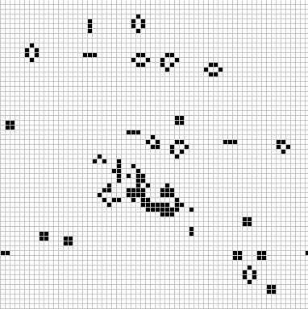

From the rust book example at https://rustwasm.github.io/book/game-of-life/hello-world.html

### Setup
Run the following commands to install the rust toolchain, cargo-generate and node:
- `curl --proto '=https' --tlsv1.2 -sSf https://sh.rustup.rs | sh`
- `cargo install cargo-generate`
- `npm install npm@latest -g`

### Download the template
- `cargo generate --git https://github.com/rustwasm/wasm-pack-template`

### Build
- `wasm-pack build`

Generate a www/ directory with the html and JS
- `npm init wasm-app www`

Install the dependencies
- `npm install`

### Run
- `npm run start`

### Optimize
#### Optimize for size.
wasm-opt -Os -o output.wasm input.wasm

#### Optimize aggressively for size.
wasm-opt -Oz -o output.wasm input.wasm

#### Optimize for speed.
wasm-opt -O -o output.wasm input.wasm

#### Optimize aggressively for speed.
wasm-opt -O3 -o output.wasm input.wasm